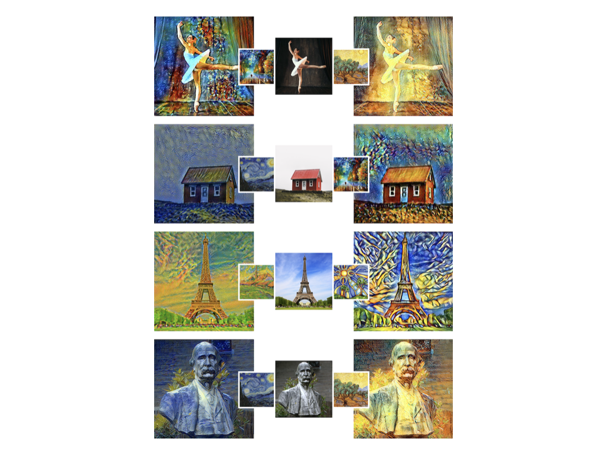

# Neural style transfer

The goal of this project is to use different deep learning techniques in order to merge the style of one image and the content of another image (*neural style transfer*).



## Techniques

The different techniques used are :

* *A Neural Algorithm of Artistic Style* by Gatys et al. [[paper](https://arxiv.org/abs/1508.06576)] : located in `python/gatys/`
* *Unpaired Image-to-Image Translation using Cycle-Consistent Adversarial Networks* by Zhu et al. [[paper](https://arxiv.org/abs/1703.10593)] : located in `python/cycle-gan/`

## How to run the code ?

The different techniques have been implemented in **python** (version 3) mainly via the [PyTorch](https://pytorch.org) library.

To create the necessary anaconda virtual environment (named *neural_style_transfer*), do

```bash
make create-env
```

or create the environment manually via the `environment.yml` file provided.

To use a technique, make sure to activate the virtual environment and do

```bash
make <technique-name>
```

or manually run the `main.py` file located in the `python/<technique-name>/` folder.

Each hyperparameter of a technique can be modified via the corresponding `main.py` file.

## Context

This project was realized as part of the *Deep learning* course given by Professor **Louppe** to the master students of Civil Engineering (Computer Science) at the [University of Liège](https://www.uliege.be/) during the academic year 2019-2020.

## Authors

* **Maxime Meurisse** - [meurissemax](https://github.com/meurissemax)
* **Adrien Schoffeniels** - [schoffeniels](https://github.com/schoffeniels)
* **Valentin Vermeylen** - [ValentinVermeylen](https://github.com/ValentinVermeylen)
